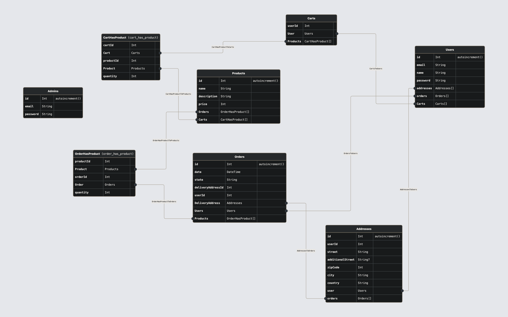

# E-Commerce platform project

## Context

The idea of this project is to create the APIs to manage both the admin side and the public side 
of an e-commerce web platform.

##### As an admin:
It will be possible to manage the products catalog and to handle users orders.
As well as managing other admin accounts.

##### As a public user:
It will be possible to create an account, login and have a proper shopping experience 

## Features

##### An admin can:
* Create another admin account
* Delete another admin account
* Browse admin accounts
* Change its own password
* CRUD products
* Browse orders
* Update orders statuses

##### A public user can:
* Sign-in
* Login
* Browse products
* Add product to its shopping cart
* Get its shopping cart
* Update its shopping cart
* Proceed to order
* Browse its orders

## Architectural decision

*TL;DR*

|  | 
|:------------------------------------:| 
|             *DB Schema*              |

As the different entities that would be needed for this project are tightly coupled between each other
(eg: users and carts/orders/addresses)
I decided to opt for a relational database.

For this quick project and for the ease of use, I choose to go with a simple sqlite database.

For a production ready application, it would indeed need a more robust DB.

## Folder structures

There is 2 main folder in the project:
- `domain`
- `routes`

#### Domain
In the domain folder you'll find everything DB related.

The dao folder hold all the access to the DB.
Meaning all the queries definition divided by a folder for each DB entity.
Next the prisma folder have all data related to prisma, from schema definitions to migrations.

#### Routes
In the routes folder you'll have everything related to the different API endpoints.
This folder is then divided in 2 sub-folders, *admin* & *public*. 
Each one respectively holding the API endpoints of the same name. 
Each of them is then divided by the entity path.

In every entity path folder you'll find:
 - a `routes.ts` file: The endpoints definitions
 - a `controllers.ts` file: the business logic for each endpoint

If needed you'll also find:
 - a `schemas.ts` file: the schemas definitions of body/path for your requests
 - a `types.ts` file: every type definition used for this entity

## 
In the `auth` folder, you'll find utilities functions to handle JWTs and passwords

## How to run

You'll need to have <u>_Node.js v20_</u>

You then have to run

``npm i``

You should have now a server running locally on port: `7777`

## How to query the APIs

You can get the full collection of all endpoints with the following [Insomnia](https://insomnia.rest/) file available at the root of the project

_**insomnia-collection.json**_

Simply import the file into your insomnia workspace and you're all set ! 

_PS: an admin account is already seeded in the database_
>
> mail: `admin@email.com`
> 
> password: `1234567`

## Improvements

A few improvements could be made to enhance the usage of the api.

The main one would be the ability to use bulk action.
For instance the ability to update multiple order statuses as admin.
To delete multiple products/admins as well.
